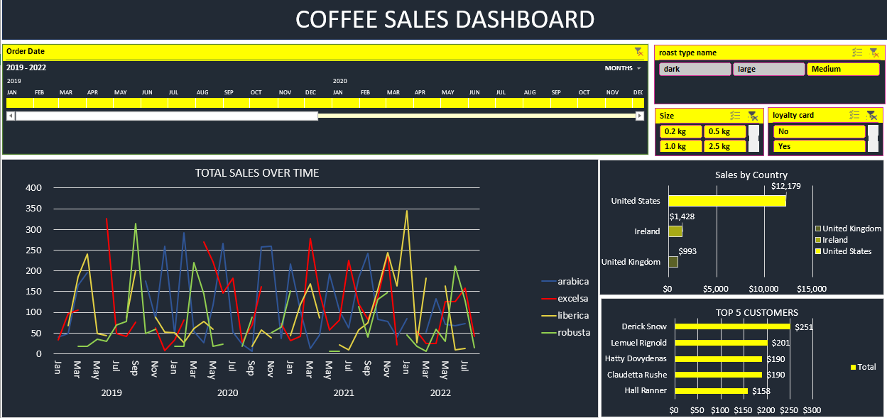

# ☕ Coffee Sales Dashboard (Excel-Based)

An Excel-based dashboard that visualizes coffee sales data from 2019 to 2022. It includes interactive slicers, charts, and filters to help analyze coffee sales trends across different types, sizes, and customer segments.

---

## 📊 Features

- **Total Sales Over Time**  
  Line chart showing monthly sales trends by coffee type (Arabica, Excelsa, Liberica, Robusta).

- **Sales by Country**  
  Bar chart comparing total revenue from:
  - United States
  - Ireland
  - United Kingdom

- **Top 5 Customers**  
  Highlights the five highest-spending customers.

- **Filters & Slicers:**
  - **Order Date** (Jan 2019 – Jul 2022)
  - **Roast Type** (dark, medium, large)
  - **Package Size** (0.2 kg, 0.5 kg, 1.0 kg, 2.5 kg)
  - **Loyalty Card** (Yes / No)

---

## 📁 Files Included

| File Name                | Description                                |
|--------------------------|--------------------------------------------|
| `coffee_dashboard.xlsx`  | Main Excel dashboard file                  |
| `dashboard-screenshot.png` | Image preview of the dashboard          |
| `README.md`              | Project overview and setup instructions    |
| `DATA_DICTIONARY.md`     | Definitions and explanations of fields     |

---

## 🔍 Key Insights

- **United States** leads with $12,179 in sales.
- **Arabica** and **Liberica** have the highest peaks.
- **Derick Snow** is the top customer ($251).
- Seasonal spikes are visible in January and September.

---

## 🧰 Tools Used

- **Microsoft Excel** (Pivot Tables, Slicers, Charts)
- No external BI tools or add-ins were used.
